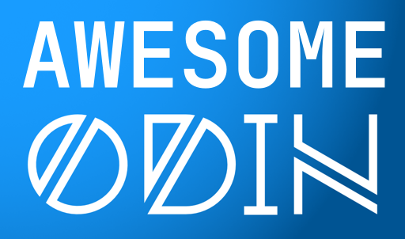

A collection of awesome Odin libraries, software and resources.

[Odin](https://odin-lang.org/) is a general-purpose programming language built for high-performance, modern systems and data-oriented programming.

A star (⭐) means the resource is exceptionally good.

> [!NOTE]
> Some of the lists are based on the [Odin Libs Wiki Page](https://github.com/odin-lang/Odin/wiki/Odin-Libs)

> [!IMPORTANT]
> Many commonly used bindings are already included in the [Vendor Collection](https://pkg.odin-lang.org/vendor/) which comes with the compiler

# Contents
- [Libraries](#libraries)
- [Bindings](#bindings)
- [Gists](#gists)
- [Resources](#resources)
- [Built with Odin](#built-with-odin)
- [Links](#links)

## Other Lists
- [Odin Wiki Libs](https://github.com/odin-lang/Odin/wiki/Odin-Libs)
- [Core Library Collection](https://pkg.odin-lang.org/core/)
- [Vendor Library Collection](https://pkg.odin-lang.org/vendor/)

# Packages
## Libraries
List of libraries implemented in Odin.

> [!NOTE]
> Resources have tags based on their topics for easier CTRL+F search

### Gamedev
| Name | Description | License | Tags |
| ---- | ----------- | ------- | ---- |
| [LBP Serialization](https://github.com/jakubtomsu/odin-lbp-serialization) | Easy-to-use LBP binary serialization utility | [MIT](https://github.com/jakubtomsu/odin-lbp-serialization/blob/main/LICENSE) | Gamedev, Serialization, Assets
| [GL Font](https://github.com/vassvik/odin-gl_font) | A library for quickly setting up font rendering | [Missing](https://github.com/vassvik/odin-gl_font/blob/master/LICENSE) | OpenGL, Graphics, Font
| [jobs](https://github.com/jakubtomsu/jobs) | Job system | [MIT](https://github.com/jakubtomsu/jobs/blob/main/LICENSE) | Gamedev
| [glcache](https://github.com/DragosPopse/glcache) | Cached OpenGL calls | None | OpenGL, Graphics, Gamedev
| [Marshmallow engine](https://github.com/DragosPopse/marshmallow) | WIP Game Engine written in pure Odin | None | Gamedev, Engine

### Formats
| Name | Description | License | Tags |
| ---- | ----------- | ------- | ---- |
| [Vox loader](https://github.com/jakubtomsu/odin-vox) | Simple loader for MagicaVoxel's `.vox` models | [MIT](https://github.com/jakubtomsu/odin-vox/blob/main/LICENSE) | Gamedev, Assets
| [LDtk utility](https://github.com/jakubtomsu/odin-ldtk) | Simple loader for LDtk files. LDtk is a moder 2D level editor from the creator of Dead Cells | [MIT](https://github.com/jakubtomsu/odin-ldtk/blob/main/LICENSE) | Gamedev, Assets, Tools
| [File Formats](https://github.com/Kelimion/odin_file_formats) | Odin implementations of various file formats - ISO, EBML | [BSD-3](https://github.com/Kelimion/odin_file_formats/blob/master/LICENSE.md) | Format
| [INI Parser](https://github.com/laytan/odin-ini-parser) | .INI file parser | [MIT](https://github.com/laytan/odin-ini-parser/blob/main/LICENSE) | Format
| [PDB reader](https://github.com/DaseinPhaos/pdb) ⭐ | A library for reading `.pdb`s and dumping Windows stacktraces | [BSD-2-Clause](https://github.com/DaseinPhaos/pdb/blob/main/LICENSE) | Debugging, Auxiliary
| [Java classfile parser](https://github.com/FourteenBrush/Classreader) | A parser and verifier for Java `.class` files | [MIT](https://github.com/FourteenBrush/Classreader/blob/main/LICENSE) | Format, Java classfile

### Networking
| Name | Description | License | Tags |
| ---- | ----------- | ------- | ---- |
| [Odin HTTP](https://github.com/laytan/odin-http) ⭐ | A HTTP/1.1 server & client implementation for Odin purely written in Odin (besides OpenSSL) | [MIT](https://github.com/laytan/odin-http/blob/main/LICENSE) | Webdev, Server, Networking
| [HTTP](https://github.com/Inch4Tk/odinhttp) | Simple Odin http(s) client | [BSD-3](https://github.com/Inch4Tk/odinhttp/blob/master/LICENSE) | Webdev

### Webdev
| Name | Description | License | Tags |
| ---- | ----------- | ------- | ---- |
| [GraphQL Parser](https://github.com/thetarnav/odin-graphql-parser) | GraphQL language parser | [MIT](https://github.com/thetarnav/odin-graphql-parser/blob/main/license) | Webdev

### Data structures
| Name | Description | License | Tags |
| ---- | ----------- | ------- | ---- |
| [Red/Black Tree](https://github.com/wilig/red_black_tree) | Red Black Tree Implementation | None | Datastructure
| [Piece Table](https://github.com/xDahl/Piece-Table) | Piece-Table implementation written in Odin, and comes with unlimited linear undo & redo capability | [MIT](https://github.com/xDahl/Piece-Table/blob/main/LICENSE) | Datastructure
| [Shared Memory Queue](https://github.com/0xULT/shm_queue) | Thread safe lock free ring buffers that seek to minimize false sharing, MPMC and SPMC | None | Datastructure, Multithreading

### Other
| Name | Description | License | Tags |
| ---- | ----------- | ------- | ---- |
| [Simple History](https://github.com/Skytrias/simple-history) | A simple undo / redo history | [MIT](https://github.com/Skytrias/simple-history/blob/master/LICENSE) | UI, Gamedev, Tools, Editor
| [ADS1256 driver](https://github.com/Platin21/ads1256-odin) | Driver for Ti ADS1256 | [MIT](https://github.com/Platin21/odin-bcm2835/blob/main/LICENSE) | Embedded
| [Mani](https://github.com/DragosPopse/mani) | Lua bidirectional bindings generator | None | Lua, Generator
| [odin-build](https://github.com/DragosPopse/odin-build) | Build system for Odin | None | Auxiliary, Tooling
| [Snowflake](https://github.com/laytan/odin-snowflake) | Twitter Snowflake UID generation | [MIT](https://github.com/laytan/odin-snowflake/blob/main/LICENSE) | UID
| [App Version](https://github.com/wiremoons/app_version) | Generate and display application version information | [MIT](https://github.com/wiremoons/app_version/blob/main/LICENSE) | Tools, Utility, CLI
| [CLI Argument Parser](https://github.com/GoNZooo/odin-cli) | Using types to specify how command line arguments should be parsed | None | Utility, CLI, Parser
| [Odin-style CLI Argument Parser](https://github.com/SjVer/ClOdin) | A command-line argument parser mimicking the Odin compiler's style | [MIT](https://github.com/SjVer/ClOdin/blob/main/LICENSE) | CLI, Utility, Parser
| [Terminal Color](https://github.com/hrszpuk/odin-color) | Simple, easy to use terminal colors | [MIT](https://github.com/hrszpuk/odin-color/blob/main/LICENSE) | CLI, Utility
| [Back](https://github.com/laytan/back) | Cross-platform back/stack traces for assertion failures, the tracking allocator, and segfaults | [MIT](https://github.com/laytan/back/blob/main/LICENSE) | Debugging, Auxiliary

## Built-in
This is a list of notable libraries which are distributed along with the Odin compiler. For a full list head over to [Official Package Documentation](https://pkg.odin-lang.org/).

### Base
Base packages are required by the compiler

| Name | Description |
| ---- | ----------- |
| [builtin](https://pkg.odin-lang.org/base/builtin/) | Contains Odin's predeclared identifiers, like basic types, procedures like `len`, `size_of` etc and many built-in constants like `ODIN_DEBUG`
| [intrinsics](https://pkg.odin-lang.org/base/intrinsics/) | Contains Odin's compiler-level intrinsics, including many low-level procs like atomics, SIMD, X86 or WASM intrinsics and compile-time type reflection
| [runtime](https://pkg.odin-lang.org/base/runtime/) | This is the runtime code required by the compiler. Contains definitions of context, allocator, logger, map, dynamic array, type_info etc. and implements things like appending to a dynamic array

### Core
The core packages implement most of the common features you need while working with Odin

| Name | Description |
| ---- | ----------- |
| [fmt](https://pkg.odin-lang.org/core/fmt/)                      | String formatting and console printing
| [os](https://pkg.odin-lang.org/core/os/)                        | Cross-platform OS interface. Read files, change CWD, etc.
| [strings](https://pkg.odin-lang.org/core/strings/)              | Common string operations
| [math](https://pkg.odin-lang.org/core/math/)                    | Common math procedures
| [math/linalg](https://pkg.odin-lang.org/core/math/linalg/)      | Linear algebra package for 2D and 3D math with vectors, matricies and quaternions
| [mem](https://pkg.odin-lang.org/core/mem/)                      | Common memory operations and allocators
| [encoding/json](https://pkg.odin-lang.org/core/encoding/json/)  | Implements a JSON reader/writer, including a way to automatically marshal (serialize) structs
| [log](https://pkg.odin-lang.org/core/log/)                      | Implements a console and a file logger
| [sort](https://pkg.odin-lang.org/core/sort/)                    | Implements sorting algorithms
| [sync](https://pkg.odin-lang.org/core/sync/)                    | Synchronization primitives for multithreading
| [thread](https://pkg.odin-lang.org/core/thread/)                | Create and manage OS threads
| [reflect](https://pkg.odin-lang.org/core/reflect/)              | Runtime type reflection
| [path/filepath](https://pkg.odin-lang.org/core/path/filepath/)  | File path string operations

### Vendor
Vendor packages are commonly-used third-party libraries distributed along with the compiler

| Name | Description | Tags |
| ---- | ----------- | ---- |
| [raylib](https://pkg.odin-lang.org/vendor/raylib/) ⭐               | Bindings for [Raylib](https://www.raylib.com/index.html), a simple and easy-to-use library to enjoy videogames programming | Gamedev, Graphics
| [glfw](https://pkg.odin-lang.org/vendor/glfw/)                   | Bindings for [GLFW](https://www.glfw.org/), a multi-platform library for OpenGL, OpenGL ES and Vulkan development on the desktop | Gamedev, Graphics
| [lua](https://pkg.odin-lang.org/vendor/lua/)                     | Bindings for [Lua](https://www.lua.org/about), a powerful, simple and embeddable scripting language | Lua
| [fontstash](https://pkg.odin-lang.org/vendor/fontstash/)         | Odin implementation of [Fontstash](https://github.com/memononen/fontstash) - a lightweight online font texture atlas builder | Gamedev, Text, Graphics
| [miniaudio](https://pkg.odin-lang.org/vendor/miniaudio/)         | Bindings for [Miniaudio](https://miniaud.io/), a lightweight audio library | Audio, Gamedev
| [microui](https://pkg.odin-lang.org/vendor/microui/)             | Odin implementation of [microui](https://github.com/rxi/microui), a tiny immediate-mode UI library | UI, Tools, ImGui, Gamedev
| [directx/d3d11](https://pkg.odin-lang.org/vendor/directx/d3d11/) | D3D11 bindings | Gamedev, Graphics, 3D
| [cgltf](https://pkg.odin-lang.org/vendor/cgltf/)                 | Bindings for a GLTF asset loader | Gamedev, Graphics, Format, Assets
| [darwin/Metal](https://pkg.odin-lang.org/vendor/darwin/Metal/)   | Bindings for Metal API | Gamedev, Graphics, 3D
| [stb](https://pkg.odin-lang.org/vendor/stb/)                     | Bindings for libs from [STB](https://github.com/nothings/stb) | Format, Gamedev, Assets, Utility
| [sdl2](https://pkg.odin-lang.org/vendor/sdl2/)                   | Bindings for [SDL2](https://www.libsdl.org), a cross-platform development library | Gamedev, Graphics, Audio, Networking                    

## Bindings
List of Odin bindings to C/C++ libraries.

| Name | Description | License | Tags |
| ---- | ----------- | ------- | ---- |
| [Dear Imgui](https://gitlab.com/L-4/odin-imgui) ⭐ | Generated Dear ImGui bindings using dear_bindings. About Dear ImGui is a bloat-free Graphical User interface for C++ with minimal dependencies | [MIT](https://gitlab.com/L-4/odin-imgui/-/blob/main/LICENSE?ref_type=heads) | UI, ImGui, Gamedev, Tools, C++, Cross Platform |
| [Tracy](https://github.com/oskarnp/odin-tracy) ⭐ | Bindings for the Tracy profiler | [BSD-2-Clause](https://github.com/oskarnp/odin-tracy/blob/master/LICENSE) | Gamedev, Performance
| [ufbx](https://github.com/cshenton/odin-ufbx)          | A binding for [ufbx](https://github.com/ufbx/ufbx), a simple FBX loader library | [Unlicense](https://github.com/cshenton/odin-ufbx/blob/master/LICENSE) | Gamedev, Assets, 3D |
| [OpenAL](https://github.com/thebirk/odin-al)               | A binding for [OpenAL](https://www.openal.org), a cross-platform 3D audio API | [MIT](https://github.com/thebirk/odin-al/blob/master/LICENSE) | Gamedev, Audio |
| [Termbox](https://github.com/thebirk/odin-termbox)     | A binding for [termbox](https://github.com/nsf/termbox), a text-based user interface alternative to ncurses | [MIT](https://github.com/thebirk/odin-termbox/blob/master/LICENSE) | UI
| [Rift](https://github.com/vassvik/odin-rift)           | A binding for the Oculus Rift SDK for VR | [Unlicense](https://github.com/vassvik/odin-rift/blob/master/LICENSE) | Gamedev, VR
| [librg](https://github.com/librg/librg-odin)           | A binding for [librg](https://librg.handmade.network/), MMO networking library   | [Missing](https://github.com/librg/librg-odin/blob/master/LICENSE) | Gamedev, Server, Networking
| [XInput](https://github.com/ThisDrunkDane/odin-xinput) | A binding for [XInput](https://docs.microsoft.com/en-us/windows/desktop/xinput/), a windows input library | [MIT](https://github.com/ThisDrunkDane/odin-xinput/blob/master/LICENSE) | Gamedev, Windows, Input 
| [zeromq](https://github.com/zaklaus/odin-zeromq)       | A binding for [ZeroMQ](http://zeromq.org/), An open-source universal messaging library | [Missing](https://github.com/zaklaus/odin-zeromq/blob/master/LICENSE) | Networking
| [ObjC](https://github.com/Platin21/odin-objc) | Bindings for the objc 2.0 runtime | [MIT](https://github.com/Platin21/odin-objc/blob/master/LICENSE) | Darwin
| [LibClang](https://github.com/Platin21/odin-clang) | Bindings for libClang for Odin | None |
| [Freetype](https://github.com/englerj/odin-freetype) | A binding for [FreeType](https://www.freetype.org/) | [MIT](https://github.com/englerj/odin-freetype/blob/main/LICENSE) | Graphics, Text, Gamedev
| [CUE SDK](https://github.com/Kelimion/odin-cue-sdk) | Bindings for the [Corsair CUE SDK](https://github.com/CorsairOfficial/cue-sdk). Developers can use the iCUE SDK to access CORSAIR devices, enabling them to control device LEDs and create custom lighting experiences. | [Unlicense](https://github.com/Kelimion/odin-cue-sdk/blob/master/corsair-cue/bindings.odin) |
| [bcm2835](https://github.com/Platin21/odin-bcm2835/tree/main) | Bindings for BCM2835 Broadcom chip/raspberry pi1/2/3/4 | [MIT](https://github.com/Platin21/odin-bcm2835/blob/main/LICENSE) | Embedded
| [Mimalloc](https://github.com/jakubtomsu/odin-mimalloc) | Bindings for [mimalloc](https://github.com/microsoft/mimalloc) | [MIT](https://github.com/jakubtomsu/odin-mimalloc/blob/main/LICENSE) | Memory, Allocator
| [MySql](https://github.com/laytan/odin-mysql) | Bindings for MySQL Client | [MIT](https://github.com/laytan/odin-mysql/blob/main/LICENSE) | Database, Webdev, SQL
| [PostgreSQL](https://github.com/laytan/odin-postgresql) | Complete & documented bindings for [libpq (PostgreSQL)](https://www.postgresql.org/) | [MIT](https://github.com/laytan/odin-postgresql/blob/main/LICENSE) | Database, Webdev, SQL
| [LZ4](https://github.com/jakubtomsu/odin-lz4) | Bindings for [LZ4](https://github.com/lz4/lz4), an extremely fast lossless compression library | [BSD 2 Clause](https://github.com/jakubtomsu/odin-lz4/blob/main/LICENSE) | Compression, Gamedev
| [FMOD](https://github.com/jakubtomsu/odin-fmod) | Bindings for [FMOD](https://www.fmod.com/) | [MIT](https://github.com/jakubtomsu/odin-fmod/blob/main/LICENSE) | Gamedev, Audio
| [Steamworks](https://github.com/jakubtomsu/odin-steamworks) | Bindings for [Steamworks SDK](https://partner.steamgames.com/doc/sdk) | [MIT](https://github.com/jakubtomsu/odin-steamworks/blob/main/LICENSE) | Gamedev
| [libbfd](https://github.com/wardjm/odin-bfd) | Bindings for [libbfd](https://github.com/CyberGrandChallenge/binutils/tree/master/bfd) | [GPLv2](https://github.com/wardjm/odin-bfd/blob/main/LICENSE) |
| [EFSW](https://github.com/dch-GH/efsw-odin) | Bindings for the [Entropia file system watcher\(https://github.com/diegostamigni/efsw) | [Unknown](https://github.com/dch-GH/efsw-odin/blob/main/LICENSE) | Files
| [Nuklear](https://github.com/cr15th0f3r/odin-nuklear) | Bindings for [Nuklear](https://github.com/Immediate-Mode-UI/Nuklear), s single-header ANSI C immediate mode cross-platform GUI library |  None | UI, ImGUI, Gamedev, Cross Platform |
| [Box2C](https://gitlab.com/L-4/odin-box2c) | Idiomatic Odin bindings for Box2c (aka Box2D 3.0, not to be confused with older versions which were written in C++!) | None | Gamedev, Physics
| [Box2C (Odin-style)](https://github.com/cr15th0f3r/odin-box2d) | Box2D 3.0 bindings for Odin language | None | Gamedev, Physics
| [Sokol](https://github.com/floooh/sokol-odin/) ⭐ | Odin bindings for [Sokol](https://github.com/floooh/sokol/), a collection of single-header C libraries for cross-platform windowing, graphics, audio, file loading, and more! | [zlib](https://github.com/floooh/sokol/blob/master/LICENSE) | Gamedev, Input, Audio, Cross-Platform

# Gists
Useful Github Gists in Odin.

| Name | Description | Tags |
| ---- | ----------- | ---- |
| [GLFW, OpenGL Window Tutorial](https://gist.github.com/SorenSaket/155afe1ec11a79def63341c588ade329) | GLFW and OpenGL example with very verbose comments and links to documentation for learning | Gamedev, Graphics, GPU, Learning, OpenGL, GLFW |
| [Metal in Odin](https://gist.github.com/gingerBill/e1270f60a1739c266934599c2bee46f5) | Example of using Metal in Odin Natively | Gamedev, Graphics, GPU, Metal, Darwin, SDL, Shaders |
| [3D Collision](https://gist.github.com/jakubtomsu/9cae5298f86d2b9d2aed48641a1a3dbd) | Simple raylib example of 3d FPS player movement with triangle collision | Gamedev, Raylib, Graphics, Physics, 3D |
| [Block Allocator](https://gist.github.com/cshenton/d8db9bded49706ed4b28adb9bd937fcb) | Allocator based on Sebastian Aaltonen's Offset Allocator, for suballocating GPU heaps | Gamedev, GPU, Memory, Allocator |
| [Octahedral Mapping](https://gist.github.com/jakubtomsu/e614bf152a7147c4519149270b9266b6) | Sphere and Hemisphere Octahedral mapping visualization in Odin and Raylib | Gamedev, Graphics, GPU, Raylib |
| [MicroUI SDL Demo](https://gist.github.com/gingerBill/5bbcca224bf8d9dcd09dde38b2567d10) | A demo of MicroUI + SDL2 | Gamedev, UI, ImGui, SDL |
| [MicroUI Raylib Demo](https://gist.github.com/gingerBill/c7a91318bd7b3be96d63d428b24d19ea) | A demo of MicroUI + Raylib | Gamedev, UI, ImGui, Raylib |
| [SDL OpenGL Demo](https://gist.github.com/gingerBill/b03c2ea6ed693034a609e56076fda3dc) | Simple SDL2 + OpenGL demo | Gamedev, Graphics, OpenGL, SDL, 3D |
| [D3D11 in Odin](https://gist.github.com/gingerBill/b7b75772f92c5511a9cd3ca2e28eca37) | Simple D3D11 based on d7's example | Gamedev, Graphics, Windows, SDL, 3D |
| [Vulkan Example](https://gist.github.com/terickson001/bdaa52ce621a6c7f4120abba8959ffe6) | Vulkan-tutorial example in Odin | Gamedev, Graphics, Vulkan, GLFW, Shaders |
| [Minimal Metal Window](https://gist.github.com/Lperlind/1bb993a1c0f1acdd49080fd4852f95c5) | Minmal Cocoa Window with Metal API | Gamedev, Darwin, Metal, Cocoa, Graphics |
| [D3D12 Triangle](https://gist.github.com/jakubtomsu/ecd83e61976d974c7730f9d7ad3e1fd0) | Single-procedure D3D12 triangle example | Gamedev, Graphics, D3D12, Shaders, SDL |
| [UUIDV4](https://gist.github.com/laytan/9053ea979bdbc5ebb4bf66d4caf5c402) | UUID Generator | UID, Cryptography, Wevdev |
| [WASM4 Bindings](https://gist.github.com/gingerBill/9a6c0a6f0a34a147ff82e9f6047db2ac) | WASM-4 Bindings | Webdev, WASM, Graphics |
| [Text Editor](https://gist.github.com/pJotoro/fae7bc4ea3c551d40d2e8d5b67c119d4) | Simple text editor | Graphics, Tools, Editor, UI, Font
| [Odin logger for Raylib](https://gist.github.com/laytan/e411288bc622eaf09832e752b31c9bc8) | Raylib logging callback to Odin logger | Gamedev, Tools, Utility
| [GLFW and Vulkan Boilerplate](https://gist.github.com/laytan/ba57af3e5a59ab5cb2fca9e25bcfe262) | Odin, GLFW & Vulkan boilerplate for Drawing a Triangle based on https://vulkan-tutorial.com | Gamedev, Graphics, Vulkan, GLFW, Shaders

# Resources
List of Odin tutorials, articles, videos and other resources.

| Name | Description | Tags |
| ---- | ----------- | ---- |
| [Odin Overview](https://odin-lang.org/docs/overview/) ⭐ | Official Odin language overview | Example, Article
| [Memory Allocation Strategies](https://www.gingerbill.org/article/2019/02/01/memory-allocation-strategies-001/) ⭐ | Series about memory allocation by GingerBill | Article
| [demo.odin](https://github.com/odin-lang/Odin/blob/master/examples/demo/demo.odin) | A demo of basically all odin features | Example 
| [Introduction to the Odin programming language](https://www.youtube.com/watch?v=VLcTrUhSdlg&list=PLEQTpgQ9eFCGlQa2z0j_TQTGggHOIF8Z1&ab_channel=RickardAndersson) | Video series about Odin and programming | Youtube, Playlist |
| [Space Shooter with SDL2 and Odin](https://youtu.be/GxuEeAqtlWc?si=Bfa38kWo_RFUPV2b) | Video series about programming a Space Shooter game with SDL2 and Odin | Youtube, Tutorial, Playlist |
| [Odin Programming Language: An Introduction](https://youtu.be/rCqFdYUnC24?si=Oq2FEfF1Zi2dVzv9) | Introduction to the Odin Programming Language by Ginger Bill from 2020-11-26 | Youtube, Talk |
| [Jai vs Odin systems programming languages](https://youtu.be/M763xHjsPk4?si=2Q_c2DGmC_yn0b2U) | Comparison of Jai and Odin (Non-spicy takes!) | Youtube |
| [Why I Use Odin for Game and Engine Development](https://youtu.be/D9oO4L0vt_U?si=dwUHl1NVlqqvMk3Q) | Video essay explaining what makes Odin great for game and engine development | Youtube, Gamedev |
| [Make games using Odin + Raylib](https://youtu.be/tIoQ5jMo4bE?si=kbHNLyzps1TSjbPk) ⭐ | Series about making a 2D platformer in Odin and Raylib | Youtube, Playlist, Gamedev |
| [5 Reasons why Odinlang is great for gamedev](https://youtu.be/ZBfOUa8wY1I?si=dHMcIkNyOi3cLac4) | Video about what makes odin great for gamedev | Youtube, Gamedev |
| [Odin + WASM = 💙](https://github.com/thetarnav/odin-wasm) | Example of using Odin, WASM and WebGL together. | Example, WASM, Webdev
| [Solar Storm Renderer](https://jakubtomsu.github.io/posts/solar_storm_renderer/) | A deepdive into the rendering techology of the game Solar Storm | Article
| [Hot Reload](https://zylinski.se/posts/hot-reload-gameplay-code/) | Hot reload gameplay code. What, why, limitations and examples! | Gamedev, Utility, Article
| [Raylib + Odin + WASM](https://github.com/Caedo/raylib_wasm_odin) | Experiment with using Raylib + Odin on web | Gamedev, Raylib, WASM, Example

## Interviews
- [ThePrimeagen - Odin Creator Ginger Bill Talks Odin](https://youtu.be/nVa9mgRcVPs?si=Thf2agqoYtYYsXIR)
- [Developer Voices - Is Odin "Programming done right"? (with Bill Hall)](https://youtu.be/aKYdj0f1iQI?si=oBESSHmgSZGYEPmw)
- [Mike Shah & Ginger Bill - Programming Proverbs and the Odin programming language](https://youtu.be/IXUfD5c5wp4?si=fga31CkhzYBLeZ0W)

# Tooling
A linter is built into the compiler, see `odin help check`, specifically the `-vet-*` and `-strict-style` flags.

- [[DanielGavin/ols](https://github.com/DanielGavin/ols)]: Language Server / Editor Support 
  - also contains a standalone formatter in the `tools/odinfmt` directory
- [[obiwan87/odin-intellij](https://plugins.jetbrains.com/plugin/22933-odin-support)]: Editor Support for Intellij IDEs 
- [[jtakakura/asdf-odin](https://github.com/jtakakura/asdf-odin)]: Plugin for the asdf version/package manager 
- [[laytan/setup-odin](https://github.com/laytan/setup-odin)]: GitHub action for setting up the compiler 
- [[Data-Oriented-House/PortableBuildTools](https://github.com/Data-Oriented-House/PortableBuildTools)]: Portable, simple and fast installer for Visual Studio Build Tools 

# Built with Odin
## Open-source Software
Open-source software implemented in Odin.

| Name | Description | License | Tags |
| ---- | ----------- | ------- | ---- |
| [Spall Web](https://github.com/colrdavidson/spall-web) | spall is a profiler library and a web-frontend for exploring your code and digging into potential performance problems | [MIT](https://github.com/colrdavidson/spall-web/blob/master/LICENSE) | Performance, Webdev, WASM, WebGL
| [Todool](https://github.com/Skytrias/todool) | A To-Do Editor with different modes, advanced movement & powerful commands. Track your development cycle with ease | [MIT](https://github.com/Skytrias/todool/blob/master/LICENSE) | Utility, Tools
| [HTMX Example TODO List App](https://github.com/laytan/todomvc-odin-htmx) | An implementation of Todo MVC using my in development Odin web stack. | None | Webdev, Tools
| [Dungeon of Quake](https://github.com/jakubtomsu/dungeon-of-quake) | Retro FPS game inspired by Quake | [MIT or Public Domain](https://github.com/jakubtomsu/dungeon-of-quake/blob/main/LICENSE) | Raylib, Gamedev, 3D, Shaders

## Closed-Source Software
A list of interesting software built in Odin. It's not open-source, but it can still be useful or inspiring.

| Name | Description | Tags |
| ---- | ----------- | ---- |
| [EmberGen](https://jangafx.com/software/embergen/) | Real-time smoke, fire and explosion simulations for film and games | Gamedev, GPU, Graphics, Physics |
| [GeoGen](https://jangafx.com/software/geogen/) | Real-time Landscape, terrain and planet generator app | Gamedev, GPU, Graphics |
| [Solar Storm](https://odin-lang.org/showcase/solar_storm) | Sci-fi artillery game with local multiplayer | Gamedev, GPU, Physics
| [CAT & ONION](https://odin-lang.org/showcase/cat_and_onion/) | A whimsical adventure game about a cat (NOTE: the source code is available if you buy the game on [itch.io](https://zylinski.itch.io/cat-and-onion)) | Gamedev

# Editor Support
| Name                                                    | Description                                     | License
|---------------------------------------------------------|-------------------------------------------------|-----------------------
| [OLS](https://github.com/DanielGavin/ols) ⭐              | Odin language server                            | [MIT](https://github.com/DanielGavin/ols/blob/master/LICENSE)
| [Sublime Text](https://github.com/odin-lang/sublime-odin) | Odin syntax definition for Sublime Text       | [MIT](https://github.com/odin-lang/sublime-odin/blob/master/LICENSE)
| [GNU/Emacs](https://github.com/mattt-b/odin-mode)       | Odin editing mode for GNU/Emacs                 | None
| [Flycheck](https://github.com/mattt-b/flycheck-odin) | GNU/Emacs flycheck support for Odin           | [Unlicense](https://github.com/mattt-b/flycheck-odin/blob/master/LICENSE)
| [4coder](https://github.com/Skytrias/4coder_skytrias) | 4coder customization layer for odin | None
| [Vim](https://github.com/Tetralux/odin.vim) | Odin highlighting for Vim | [MIT](https://github.com/Tetralux/odin.vim/blob/master/LICENSE)
| [Tree Sitter](https://github.com/amaanq/tree-sitter-odin) | Odin Tree-sitter grammar | [MIT](https://github.com/ap29600/tree-sitter-odin/blob/main/LICENSE)

# Deprecated
A list of outdated/deprecated/archived libraries, included for the sake of completeness and in case someone wants to update it.

| Link | Reason
|------|--------
| https://github.com/Breush/odin-binding-generator | Lost interest
| https://github.com/zhibog/odin-unittest | check out `core:testing`
| https://github.com/dotbmp/odin-json | check out `core:encoding/json`
| https://github.com/vassvik/odin-gl | check out `vendor:openGL`
| https://github.com/JoshuaManton/odin-sdl2 | check out `vendor:sdl2`
| https://github.com/kevinw/raylib-odin | check out `vendor:raylib`
| https://github.com/librg/odin-enet | check out `vendor:ENet`
| https://github.com/vassvik/odin-stb | check out `vendor:stb`
| https://github.com/sumofat/odin_cgltf | check out `vendor:cgltf`
| https://github.com/atkurtul/odinvk | check out `vendor:vulkan`
| https://github.com/SrMordred/odin-lua | check out `vendor:lua`
| https://github.com/mp768/odin-lua-bindings | check out `vendor:lua`
| https://github.com/laytan/odin-pattern | check out `core:text/match`

# Links
- [Discord](https://twitter.com/odinlang)
- [Reddit](https://www.reddit.com/r/odinlang/)
- [Twitter](https://twitter.com/odinlang)
- [Github](https://github.com/odin-lang/Odin)

# Contributions
Please submit a PR to add any interesting/useful Odin projects! Make sure to properly link license and add useful tags for easier searching.
